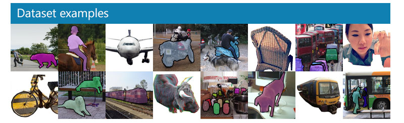

# Image-Caption-Generator
Image Caption Generator project focuses on creating a Neural Network architecture to automatically generate captions from images.

## Project: Image Captioning

The Microsoft Common Objects in COntext (MS COCO) dataset is a large-scale dataset for scene understanding. The dataset is commonly used to train and benchmark object detection, segmentation, and captioning algorithms.

Read more about the dataset on the [website](http://cocodataset.org/#home) or in the [research paper](https://arxiv.org/pdf/1405.0312.pdf).

## Project Walkthrough 

1. Exploring the Microsoft COCO Dataset: [COC0](https://github.com/chaithanya21/Image-Caption-Generator/blob/master/Dataset.ipynb)
